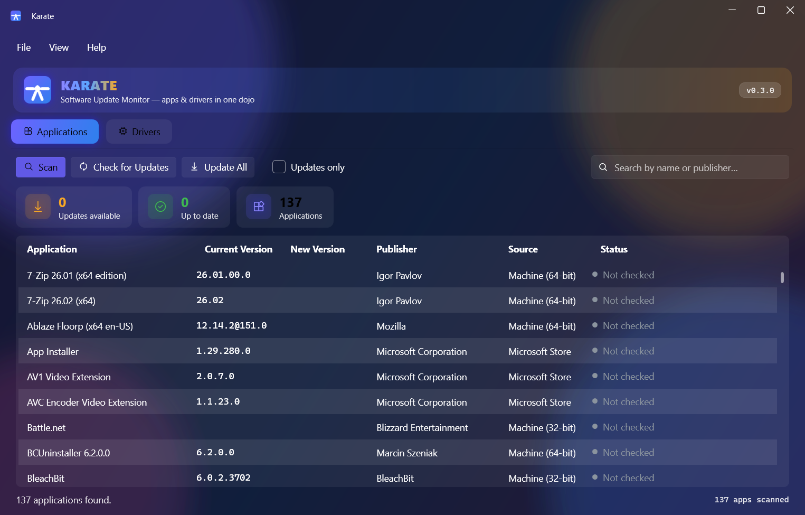

<div align="center">


# 🥋 Karate

**The software & driver update monitor for Windows — that actually updates things.**

*Apps & drivers in one dojo.*

[](https://github.com/Alielmarazig/Karate/releases/latest)
[](https://github.com/Alielmarazig/Karate/releases)
[](#-install)
[](https://dotnet.microsoft.com)
[](installer/License.rtf)



</div>

---

Remember **SUMo**? The beloved update monitor died with KC Softwares in 2023. Karate is its spiritual successor — rebuilt from scratch for modern Windows, with the two things SUMo never had: **it installs the updates it finds**, and **every source is official** (Microsoft or the hardware vendor — no proprietary databases, no scare tactics, no "47 outdated drivers!" upsells).

## ✨ What it does

### 📦 Applications
- **Scans everything** — classic installers from the registry (64-bit, 32-bit, per-user) *and* Microsoft Store / MSIX apps that other tools miss (Slack, WhatsApp, Terminal…)
- **Detects updates without needing winget installed** — Karate downloads the winget repository's own package index (13,000+ packages) and matches your apps against it locally; the winget CLI is only used as a fallback
- **One-click updating** — per-app **Update** button or **Update All**, with live per-row status (Updating… → Updated ✓) and progress counters. Uses winget when present; without it, Karate installs straight from the repository manifest with **SHA-256 verification**
- Updates sort to the top; counter cards show updates / up-to-date / total at a glance

### 🔧 Drivers
Three official channels, checked in order:
| Channel | What it finds | Update action |
|---|---|---|
| **Windows Update** | Drivers targeted at your machine | One-click install (single UAC prompt) |
| **Microsoft Update Catalog** | Newer WHQL drivers WU hasn't pushed yet, matched by hardware ID | Opens the signed package download |
| **NVIDIA direct** | Game Ready drivers weeks before Microsoft carries them | Opens NVIDIA's official download page |

Plus **driver Backup & Restore** powered by Windows' own `pnputil` — snapshot every third-party driver before you touch anything, restore after a clean reinstall.

### 🔄 Keeps itself fresh
Karate checks this repo's releases on every launch. When a new version ships, a red **⬆ update pill** appears in the banner — one click downloads it (progress ring included) and the app restarts itself on the new version.

### 💎 Liquid-glass UI
Acrylic window, drifting color orbs, gradient wordmark, animated pill tabs, glowing counter badges, monospace version numbers. Dark, warm, and alive.

## 📥 Install

Grab either from the [**latest release**](https://github.com/Alielmarazig/Karate/releases/latest):

- **`Karate-x.y.z-x64.msi`** — installer: Start Menu + Desktop shortcuts, clean uninstall, automatic upgrades
- **`Karate-x.y.z-x64-portable.exe`** — single portable file, run from anywhere

Both are 64-bit and fully self-contained — **no .NET installation required**. Windows 10 (1809+) or Windows 11.

> **SmartScreen note:** binaries are unsigned, so Windows may warn on first run — click *More info → Run anyway*.

## 🛠️ Build from source

```powershell
git clone https://github.com/Alielmarazig/Karate.git
cd Karate
dotnet run                  # dev build
.\build-installer.ps1       # release MSI (needs WiX 5: dotnet tool install -g wix --version 5.0.2)
```

**Stack:** C# / .NET 9 · WPF · [WPF-UI](https://github.com/lepoco/wpfui) (Fluent/Mica design) · CommunityToolkit.Mvvm · WiX 5

| Path | Purpose |
|---|---|
| `Services/RegistryScanner.cs` / `StoreAppScanner.cs` | Installed-software inventory |
| `Services/WingetService.cs` | Update detection + one-click upgrades |
| `Services/DriverScanner.cs` / `DriverUpdateService.cs` | WMI inventory, Windows Update search & install |
| `Services/CatalogService.cs` / `NvidiaService.cs` | Update Catalog & NVIDIA channels |
| `Services/DriverBackupService.cs` | pnputil backup / restore |
| `Services/SelfUpdateService.cs` | GitHub-powered self-updater |

## 🤝 Credits

Developed by **Alucard GGhz**.
Inspired by SUMo (KC Softwares, 2004–2023 — rest in peace).
UI built on the excellent [WPF-UI](https://github.com/lepoco/wpfui) by lepo.co.

## 📄 License

MIT — do whatever, just keep the notice.
